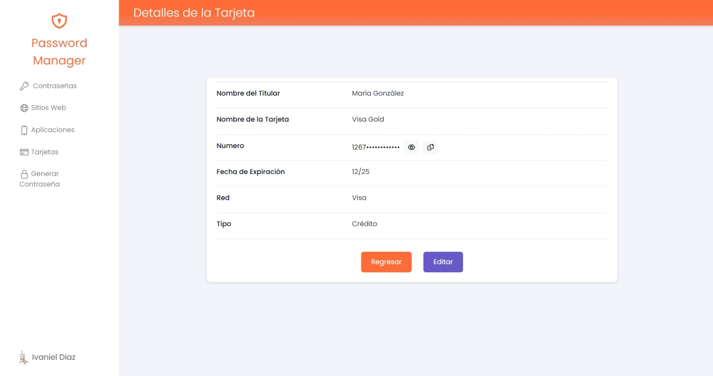

# Password Manager

## Objetivo del Proyecto
El objetivo principal de este proyecto es desarrollar un gestor de contraseñas seguro y eficiente que permita a los usuarios almacenar, generar y gestionar sus contraseñas de manera protegida. Además, el sistema está diseñado para proporcionar funcionalidades adicionales, como el almacenamiento de tarjetas (crédito, débito o pre-pago) y un sistema de búsqueda avanzado que facilita el filtrado de los datos almacenados.

El gestor está pensado para mejorar la seguridad digital de los usuarios al centralizar y proteger información sensible en un entorno seguro, eliminando la necesidad de recordar múltiples contraseñas o datos de tarjetas.

## Tecnologías
- **C#/ASP.NET Core Web API**: Lenguaje principal para el desarrollo del backend y la lógica de negocio.
- **TypeScript**: Utilizado para agregar interactividad y funcionalidades dinámicas en el frontend.
- **Angular**: Para la estructura de las vistas y componentes.
- **Bootstrap**: Para el diseño y estilizado de la interfaz de usuario.

## Paquetes del Proyecto
### ASP.NET Core:
- **Entity Framework Core**: ORM utilizado para interactuar con la base de datos de forma eficiente y sin necesidad de escribir consultas SQL manualmente.
- **Microsoft Entity Framework Core SqlServer:** Implementación específica para trabajar con SQL Server.
- **Microsoft Entity Framework Core Tools:** Proporciona herramientas como migraciones para la gestión de la base de datos desde la línea de comandos.
- **Microsoft AspNetCore Authentication JwtBearer**: Habilita la autenticación basada en JWT en aplicaciones ASP.NET Core.

### Angular: Librerías
- **SweetAlert2:** Es una librería de JavaScript para Angular que proporciona ventanas de diálogo (alertas) atractivas y personalizables, reemplazando las alertas nativas del navegador.

- **jwt-decode:** Es una pequeña librería de JavaScript que permite decodificar tokens JWT (JSON Web Tokens) en aplicaciones Angular para acceder a la información que contienen sin verificar su firma.

## Funcionalidades Principales
1. **Almacenamiento Seguro:**
    - Permite a los usuarios guardar contraseñas asociadas a diferentes cuentas o servicios.
    - Posibilidad de almacenar información adicional como datos de tarjetas (crédito, débito o prepago).

2. **Generador de Contraseñas:**
    - Genera contraseñas seguras y personalizables con diferentes opciones como longitud, uso de caracteres especiales, números, letras mayúsculas y minúsculas.
    - Incluye la opción de agregar palabras clave adicionales para facilitar el recuerdo de contraseñas complejas.

3. **Búsqueda y Filtrado:**
    - Los usuarios pueden buscar rápidamente contraseñas o datos almacenados mediante un sistema de filtrado eficiente.

4. **Autenticación Segura:**
    - Sistema de autenticación basado en cookies y con hashing de contraseñas para garantizar la protección de las credenciales de los usuarios.

5. **Interfaz Intuitiva:**
    - Diseño moderno y responsivo que facilita la navegación y la experiencia del usuario.

6. **Cierre de Sesión Seguro:**
    - Proporciona una funcionalidad para que los usuarios cierren sesión de manera segura, eliminando cualquier token de autenticación activo.

7. **Paginación:**
    - Permite visualizar la lista en una lista terminado, en este caso se configuro desde el lado del cliente (Angular).

## Seguridad
El proyecto pone énfasis en la seguridad mediante las siguientes medidas:

1. **Cifrado de Contraseñas:**
    - Las contraseñas se almacenan como hashes utilizando SHA256, lo que asegura que no se puedan revertir a texto plano.

2. **Cifrado de Datos Sensibles:**
    - Datos como contraseñas y tarjetas se cifran utilizando AES antes de ser almacenados.

3. **Autenticación:**
    - Se utiliza autenticación basada en cookies con tokens seguros para mantener las sesiones activas.

4. **Validación de Entradas:**
    - Todas las entradas del usuario se validan para evitar ataques como inyecciones SQL o XSS.

## Datos
1. **PassHasher (SHA256):**
    - Es adecuado para contraseñas de usuario (autenticación)
    - Es un hash irreversible (no se puede deshacer)
    - Bien para almacenar credenciales de acceso

2. **PassEncryptor (AES):**
    - Es adecuado para almacenar las contraseñas que el usuario quiere guardar
    - Es cifrado simétrico reversible (necesitas poder recuperar las contraseñas originales)

## Mejoras
1. **Recuperación de Contraseña:**
    - Implementar un sistema de recuperación de contraseña para usuarios que olviden sus credenciales.
    - Enviar enlaces seguros por correo electrónico para restablecer la contraseña.
2. Agregar sweet alert de confirmación para actualización de datos para Contraseñas y tarjetas.
3. Remplazar el uso de GetUserIdFromClaims en cada método por el claimUtil.

## Preview del Proyecto

### Login

### Registro

### Password: Lista

### Password: Form Agregar

### Password: Form Actualizar

### Password: Detalles

### Generador de Contraseñas

### Tarjeta: Lista 

### Tarjeta: Detalles

### Tarjeta: Form Agregar

### Tarjeta: Form Actualizar

### Perfil: Form Actualizar

